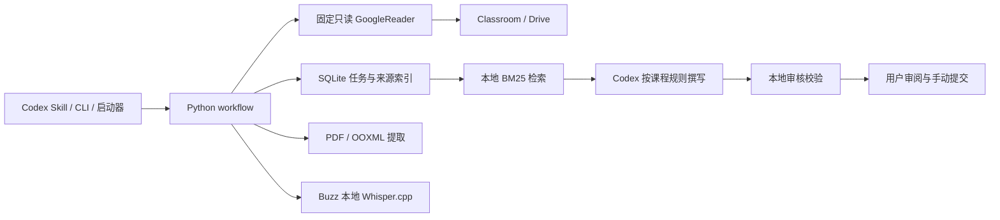

# 核心模块与持久化



## 公共调用

```python
from classroomautowork.config import Settings
from classroomautowork.workflow import prepare

settings = Settings.load()  # Git 外的真实用户配置；OAuth 必须先完成
result = prepare(settings, due_before="2026-10-10", progress=print)
for package in result["packages"]:
    print(package["package"], package["can_draft"])
```

prepare 不依赖 argparse，不生成模型答案；连接、附件提取、检索与审核均可独立调用。
GoogleReader 只公开明确读取方法，没有通用 HTTP 路由或由资料决定的方法名。
测试可替换 reader，但生产 CLI 没有 fake/mock 成功模式。

## 缓存与恢复

Store 在 Git 外使用 SQLite WAL 和跨进程文件锁。键为阶段名与输入指纹的 SHA-256。
状态为 running / done / failed / interrupted，记录尝试次数、更新时间及安全错误。
新进程持锁后将遗留 running 改成 interrupted；失败/中断阶段在下次调用重做。
done 的声明输出必须存在且 SHA-256 一致才能复用。

阶段为 classroom-snapshot、drive-download、document、media、transcript-segment、review-preparation。
缓存命中不代表远端权限仍有效；每次 sync 先读最新 metadata，并在下载后核对版本与权限。
来源索引只保留本次成功读取/处理的源，不把撤权或读取失败的陈旧文字当成现有证据。
原缓存为恢复保留在私人目录，不参与当前检索。

同一 source 更新时替换 chunks；每段带源类型、标题、链接、locator、revision 和稳定 ID。
中文、日文按双字切分，拉丁词分词，BM25 排序。按课程隔离，不索引其他学生答案。
Buzz 先由本地 ffmpeg 转成 16kHz 单声道 PCM，每五分钟独立缓存，字幕加上片段时间偏移。
模型与引擎身份变化失效推理缓存；课程内容从不传给 shell。

## 审核与信任

用户维护私人配置。课程内容只提供资料和作业约束，不能设置权限或审批。
manifest/evidence/requirements 是准备阶段的输入，不允许为通过校验而修改。
finalize 检查来源是否仍匹配当前索引，核对课程配置、引文、个人事实索引和显示的证据 ID，
生成 checksum receipt 后停止。机械检查不判断所有主张是否被证据蕴含，不代替人工审阅。
真实验证与离线测试分离：token 在 OS 凭据库，connection-receipt 在私人目录。
源码不携带账户、客户端 JSON、课程 ID、材料、缓存或真实验证样本。
