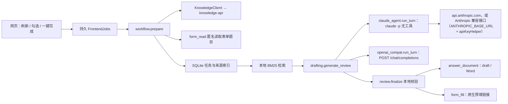

# 核心模块与持久化

```mermaid
flowchart LR
  UI[网页：刷新 / 勾选 / 一键完成] --> J[持久 FrontendJobs]
  J --> W[workflow.prepare]
  W --> K[KnowledgeClient → knowledge-api]
  W --> FR[form_read 匿名读取表单题目]
  W --> T[SQLite 任务与来源索引]
  T --> R[本地 BM25 检索]
  R --> D[drafting.generate_review]
  D --> C[claude_agent.run_turn：claude -p 无工具]
  C --> CA[api.anthropic.com，或 Anthropic 兼容接口（ANTHROPIC_BASE_URL + apiKeyHelper）]
  D --> O[openai_compat.run_turn：POST /chat/completions]
  D --> V[review.finalize 本地核验]
  V --> A[answer_document：draft / Word]
  V --> FF[form_fill：原生预填链接]
```

## 模块

| 模块 | 职责 |
| --- | --- |
| `kb_client.py` | 课程数据的唯一来源。方法名沿用旧的 reader 接口（`courses`、`assignments`、`own_submissions`、`course_materials`、`announcements`），所以 `pending.discover_pending` 和 `form_fill.current_response_urls` 不关心数据从哪来。一个实例对每门课只读一次 `posts`，同一次运行看到一致的快照。 |
| `workflow.py` | `sync_course` 把一门课的帖子、附件文档、未挂在帖子上的资料库文档（录像、笔记）写入本机检索库；`prepare_assignment` 组装资料包；`prepare` 是公共入口。 |
| `claude_agent.py` | 一次无工具的 `claude -p --bare` 回合：stdin 传入文字和 base64 页图，stdout 读 stream-json，返回 `structured_output`。Claude API 的密钥通过子进程环境变量 `ANTHROPIC_API_KEY` 传入；Anthropic 兼容接口（`base_url`、`auth="helper"`）则去掉继承的路由、凭据和请求头设置（所有 `ANTHROPIC_*`、`CLAUDE_CODE_USE_*`、`CLAUDE_CODE_OAUTH_*`、`AWS_BEARER_TOKEN_*` 等，见 `ENDPOINT_ENV`/`ENDPOINT_ENV_PREFIXES`），设 `ANTHROPIC_BASE_URL`、私有变量 `CLASSROOMAUTOWORK_RELAY_KEY` 和 `CLAUDE_CODE_DISABLE_LEGACY_MODEL_REMAP=1`（模型 id 原样发送），并以 `--settings '{"apiKeyHelper": "printenv CLASSROOMAUTOWORK_RELAY_KEY"}'` 让 CLI 把密钥作为 `X-Api-Key` 和 `Bearer` 发送，参数里没有密钥；再加 `--include-partial-messages`，回复流式传输时也有输出，慢的接口不会被空闲上限误判。`retries` 设 `CLAUDE_CODE_MAX_RETRIES`（只有连接测试用 1）。报告的模型取接口回复里的 `message.model`（init 事件只重复 `--model`）。`max_output_tokens` 只在设置时加 `CLAUDE_CODE_MAX_OUTPUT_TOKENS`；什么都不设时参数和环境与以前逐字相同（`command_line`、`turn_environment`）。没有密钥、模型或工具不一致时在发出请求前停止；`api_retry` 报 401/403 时立即停止（CLI 自己会重试约三分钟；设了 `retries` 时等结果，带接口原话）；“max_tokens: N > M …”用 M 重发一次（`max_tokens_clamp`，与第一次共用一个时限）；“exceeded the N output token maximum”给出输出上限的办法并仍可自动修复一次；CLI 去掉被拒的图片时记为 `images`；404、429、5xx、“无可用渠道”、不是 Anthropic 格式的 200 回复是 `RequestFailed`（404 的措辞按 `doubt_address` 先说地址或模型）。回合开始后抛出的 `WorkflowError` 带 `details`（`output_limit`、`degradations`），失败的记录也写下它们。错误写明是 Claude API 还是“Anthropic 兼容接口（主机）”，CLI 原话去掉密钥后放在下一行。也处理暂停、超时（`turn_seconds`/`idle_seconds` 可调）和用量上限。 |
| `api_key.py` | 网页设置的 Claude API 密钥：格式检查、向 Anthropic 验证、以 0600 权限保存，对外只给出末尾 4 位。文件格式不变；Claude API 的输出上限另存在 `claude-settings.json`（`providers.save_claude`）。 |
| `providers.py` | 选用哪个模型接口（`model-provider.json`：`anthropic`（缺省）、`anthropic_compatible` 或 `openai`）和两个兼容接口的设置，二者共用一套代码（`Kind`：`OPENAI` 存 `openai-compatible.json`，`COMPAT` 存 `anthropic-compatible.json`）：地址、密钥、模型名、可选的输出上限 `max_output_tokens`、接口列出的模型。地址规范化（OpenAI 格式去掉误贴的 `/chat/completions`；Anthropic 格式是 `ANTHROPIC_BASE_URL`，反复去掉 `/v1/messages`、`/messages` 或 `/v1` 直到没有，再读一次结果不变；主机检查相同）、输出上限校验（`parse_output_limit`：1000–1000000 的整数或空）、验证（`GET {base}/models`，或 `GET {base}/v1/models` 带 `x-api-key`、`Bearer` 和 `anthropic-version`）、以 0600 权限保存（Anthropic 兼容接口另记模型列表的格式 `list_shape`，`turn_config` 由此给出 `doubt_address`）；对外只给出主机、模型、输出上限和密钥末尾 4 位。Claude API 的输出上限在 `claude-settings.json`（`claude_status` = 密钥状态加上限）。也给出各接口的模型目录（与 Claude 官方 id 相同的模型显示官方名称；Anthropic 兼容接口用 Claude 的五档强度，默认 high），以及每个接口上次连接测试的记录（`connection-tests.json`，保存或删除设置时清空）。删除一个兼容接口只在它正被使用时改回 Claude API。 |
| `connection_test.py` | 设置里的“测试连接”：按作答相同的回合发一次很短的真实请求（一句话、一张程序生成的小图、两个字段的 schema；OpenAI 兼容接口不发推理强度，Claude API 和 Anthropic 兼容接口走 `claude_agent.run_turn`、强度 `low`、同样的环境和输出上限，在数据目录下的临时空目录里运行），限时 120 秒、空闲 60 秒，Anthropic 兼容接口只重试一次，一次只跑一个（再来的得到 `Busy`，HTTP 409）。页面断开（`webapp` 用 `select` 加 `MSG_PEEK` 看连接是否已关闭）或服务停止（`stop()`）时结束并不保存（`RunCancelled`）。结果给出用时、主机、模型、用量、费用和降级步骤（失败时也有主机和模型），错误去掉作答才需要的话（`test_wording`），回复没有按 JSON Schema 约束时提示；把 `{at, ok, model, summary}` 记为这个接口的上次测试，summary 带降级标签。三个接口都通过 `TESTERS` 里的 `Tester(check, run, marker, describe)` 接入。 |
| `openai_compat.py` | 一次 OpenAI 兼容回合：`POST {base}/chat/completions`，一条 user 消息（文字和 `image_url` 页图）、`json_schema` 严格模式、流式。后台线程读 SSE 进队列，所以暂停、15 分钟和 5 分钟空闲的限制都能立即断开连接。接口以 400/422（或 200 回复里的 400）拒绝某项功能时逐步去掉（推理强度、用量统计、JSON Schema → JSON 对象 → 只靠提示词、页图、流式），请求太长或太大时先于功能判断，只去掉页图（没有页图就直接报错），每步最多一次。发送了输出上限（`max_tokens`）时，关于它的拒绝更先判断：改名为 `max_completion_tokens`、按接口给出的最大值（或上下文长度的算式）降低、或去掉；被拒的“很高/最高”先降一档（按接口列出的值，没列出就是 `high`；拒绝的是参数本身时直接去掉）再去掉。所述最大值取话里最先出现、且不小于 1000、不带单位（K、万）的那个；OpenRouter 的 `error.metadata.raw` 按里面的原话读。`finish_reason: length` 按有没有发送上限、上限是否已是最大值、接口是否根本不接受上限参数给出不同的办法，仍会自动补一次。回合开始后抛出的 `WorkflowError` 带 `details`（与成功时的 provider 记录同形），回复是否是单独的 JSON 记为 `reply_json`。`turn_seconds`/`idle_seconds` 可调（连接测试用 120/60 秒）。本地按 schema 子集核验结果，错误写明原因和办法，接口原话截短并去掉像密钥的内容（线性时间）；不跟随跳转。请求本身失败（限流、余额、大小、5xx、网络、超时）抛 `RequestFailed`，`generate_answer` 不为它自动修复。保存时的模型列表验证整体限时 20 秒。 |
| `drafting.py` | 组装提示词与证据预算（作答失败时按 `details` 记下已发送的输出上限、推理强度和降级，`failed_turn_details`），按任务记下的接口调用 `claude_agent`（Claude API，或经 `ANTHROPIC_BASE_URL` 的 Anthropic 兼容接口）或 `openai_compat`，用 `accept_model_result` 核验并落盘。OpenAI 兼容回合的提示多一行，写明作答的模型和接口（AI 使用说明里写它，不写 Claude）；两个 Claude 回合的提示词逐字不变。复用和恢复按所选模型（而不是接口报告的模型）和接口区分；Claude API 结果的缓存键与以前相同，两个兼容接口的结果按地址另存。 |
| `ui_jobs.py` / `webapp.py` | 持久任务与 HTTP 适配层。`webapp` 同时服务本机令牌访问和 `yishuapp.com/classroom/` 前缀下的公网访问。新任务只在页面所列模型的接口（`/api/review` 和重做的 `provider`，`start_selected(shown_provider=…)`）仍是当前接口时开始，否则拒绝，不会换个账户计费。 |
| `form_fill.py` | 核验答案后生成原生预填链接。服务器上不打开浏览器，状态记为 `prefill_ready`，由用户在结果里点开。 |
| `document_fill.py` / `auth.py` / `google_read.py` | 后续版本的 Google 文档自动填写；当前运行路径不调用。 |

## 资料库数据如何变成证据

- 帖子：`coursework:<id>`、`material:<id>`、`announcement:<id>`，正文和附件列表按 1,600 字切段。
- 帖子附件：`file:<Drive 文件 ID>`。`knowledge-api` 的 `files` 映射给出对应的资料库文档；不存在或状态不是 `ready` 的列为 `warnings`。
- 资料库中未挂在任何帖子上的文档、笔记、录像：`kb:<DOC>`。
- 每段的 `locator` 形如 `第3页 · kb:4362e087#7`，同一页切成多段时也唯一，并且可以直接用 `kb read 4362e087#7` 在小主机上找到原文。
- 页面图片由 `pages.py` 生成（`kb-pages` 阶段）：课件先用无界面 LibreOffice 转成 PDF（隐藏页也导出，保证第 N 页就是第 N 张），再用 pdfium 按长边 1280 像素渲染。当前作业附带的文件每页都渲染（每份最多 40 页）；其他资料只渲染“视觉页”：课件里有大于 30KB 的图片或图表的页，PDF 里一张图片占页面四分之一以上的页。
- 图片挂在同一页的第一段证据上；没有任何提取文字的页单独生成一段证据（locator 带“页面图片”）。按文档 ID、文件大小和修改时间、文字指纹、渲染参数缓存，课件不变就不会重新渲染。
- 发给模型时最多 60 张：先是当前作业自己的文件，再是和作业相关的资料，最后是其他资料，同一份内按页码排。每张图前加一行“页面图片 N：资料 · 第几页 [E:证据ID]”，没发出的图片在提示里列出。

证据 ID 按课程、来源、修订（内容指纹）和 locator 计算。资料库内容不变，ID 就不变，已有的 AI 结果可以复用；内容变化后旧结果失效。

## 前端与访问控制

- 本机访问：`Host` 必须是 `127.0.0.1:<port>`，需要随机 Bearer 令牌，写操作要求本机 `Origin`。
- 公网访问：`Host: yishuapp.com`，路径必须在 `/classroom/` 下，必须带 Cloudflare Access 添加的 `Cf-Access-Jwt-Assertion` 请求头（只检查存在，与状态页一致），写操作要求 `Origin: https://yishuapp.com`。前端用相对路径加载资源，并根据路径自动给接口加前缀。
- `PUT /api/settings/api-key` 接受 `{key?, max_output_tokens?}`（至少一项）：`key` 空字符串表示删除，`max_output_tokens` 是 Claude API 的输出上限（`null` 或空表示不设）；密钥被拒时上限也不保存。任何接口都不返回完整密钥。
- `PUT /api/settings/provider` 只接受 `{"provider": "anthropic" | "anthropic_compatible" | "openai"}`，兼容接口没保存好时拒绝切换。`PUT /api/settings/anthropic-compatible` 与下面的 OpenAI 兼容接口路由相同（`{base_url, api_key?, models, max_output_tokens?}` 或 `{"clear": true}`），`GET /api/settings/anthropic-compatible` 与 `GET /api/settings/openai` 都给出全部接口的状态和两个兼容接口各自的模型建议（`suggestions`、`anthropic_compatible_suggestions`）。`PUT /api/settings/openai` 接受 `{base_url, api_key?, models, max_output_tokens?}`（验证通过才保存；页面总是带上 `max_output_tokens`，`null` 或空表示不设上限）或 `{"clear": true}`（删除并改回 Claude）；`GET /api/settings/openai` 给出状态和接口列出的模型建议。`POST /api/settings/test {provider: "anthropic" | "anthropic_compatible" | "openai", model?}` 跑一次连接测试，已有测试在跑时回 409；结果里没有密钥。它们和其他写操作一样要求本机令牌或 Cloudflare Access 加 `Origin`。`/api/bootstrap` 的 `provider` 块给出当前接口、Claude API 状态（密钥和输出上限）、Anthropic 兼容接口状态、OpenAI 兼容接口状态和各接口上次连接测试（`tests`）（保留原来的 `api_key` 字段）；`/api/models` 给出当前接口的模型目录，两种接口都附带 Claude 模型的显示名（`claude_names`），所以历史记录里的 Claude 模型在 OpenAI 兼容接口当前时仍显示为 Claude Sonnet 5.5 这样的名字。
- 所有课程文字以 `textContent` 呈现；接口不接受命令、解释器、权限或任意文件路径。

## 缓存与恢复

Store 在 Git 外使用 SQLite WAL 和跨进程文件锁。键为阶段名与输入指纹的 SHA-256；状态为 running / done / failed / interrupted。新进程持锁后把遗留的 running 改成 interrupted，下次调用重做。done 的输出文件必须存在且 SHA-256 一致才复用。阶段有 `form-questions`、`kb-pages`、`review-preparation`。

来源索引只保留本次读取到的来源，资料库删除或撤下的内容不会作为旧证据留下。

## 审核与信任

模型只返回数据：答案、检查表、来源 ID、表单逐栏答案。`finalize` 检查来源是否仍在当前索引、引文是否逐字匹配、个人事实是否对应用户提供的索引，生成 checksum receipt。`generation.json` 记录实际模型、会话 ID、用量、输入来源与页图摘要；Anthropic 兼容接口记录 `provider: anthropic_compatible`、主机、所选与报告的模型、用量和 Claude Code 按官方价估算的费用；Claude 回合设置了输出上限或发生降级时记 `output_limit {requested, sent, param: "CLAUDE_CODE_MAX_OUTPUT_TOKENS"}` 和 `degradations`（`max_tokens_clamp`、`images`）。OpenAI 兼容接口还记录 `provider: openai_compatible`、主机、所选与报告的模型、结构化输出方式、发送和省略的页图数、降级步骤、输出上限 `output_limit {requested, sent, param}` 和实际发送的推理强度 `effort {requested, sent}`，不记录密钥。机械检查不判断主张是否被证据蕴含，不代替人工审阅。
